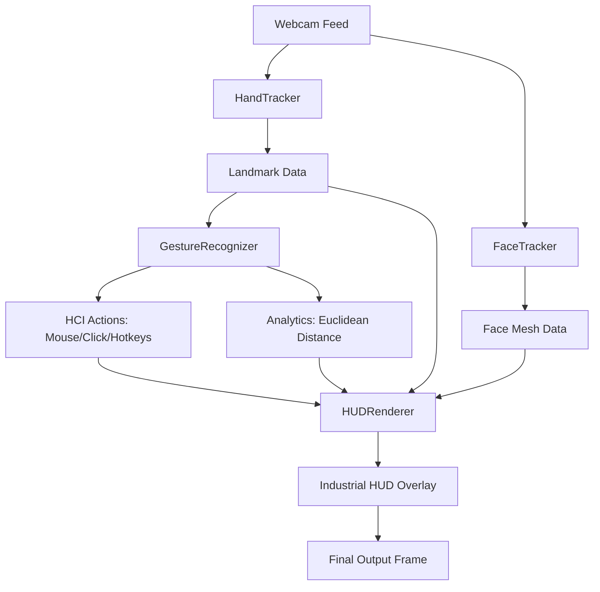

# HCI Desktop Interface Architecture 🏗️

The system is designed with a modular approach, separating Computer Vision processing, Gesture Logic, and Graphical Rendering.

## 🗺️ System Overview

## 🧩 Components

### 1. **Core Processing (MediaPipe)**
- **HandTracker (`hand_tracking.py`)**: Processes raw video frames to extract 21 points. Includes a 5-frame **Moving Average Filter** to eliminate coordinate jitter.
- **FaceTracker (`face_tracking.py`)**: Generates a 468-point face mesh for gaze-tracking and professional face-anchored AR reticles.

### 2. **Logic & Interaction Engine**
- **GestureRecognizer (`gesture_recognition.py`)**: 
    - **Euclidean Analytics**: Calculates the Euclidean distance between Tip 4 (Thumb) and Tip 8 (Index).
    - **Swipe Engine**: Tracks relative displacement of the hand center (Middle MCP) to detect velocity-based swipes in four directions.
    - **Smoothing**: Applies a 1-over-N damping factor to cursor motion.
- **OS Controller (`main.py`)**: 
    - **Resolution Mapping**: Linearly interpolates camera coordinates to OS screen resolution with a buffer to prevent edge-of-screen fail-safes.
    - **Shortcut Mapping**:
        - Horizontal Swipe -> `ctrl + win + arrow` (Desktop Shift)
        - Vertical Swipe -> `alt + tab` (Window Switch)

### 3. **Rendering Engine**
- **HUDRenderer (`hud_renderer.py`)**:
    - **3D Projection**: Implements a 3D-to-2D projection matrix for rendering wireframe geometry without external heavy libraries like PyOpenGL.
    - **Industrial UI**: A design system utilizing safety-orange accents for high visibility and silver-charcoal panels for reduced eye fatigue during professional use.

## 🚀 Interaction Flow
1. **Frame Capture**: Webcam frame in BGR.
2. **Analysis**: Face and Hand landmarks extracted via MediaPipe.
3. **Analytics**: 
    - Cursor position calculated and smoothed.
    - Pinch distance compared against threshold (25px).
    - Swipe velocity analyzed.
4. **Hardware execution**: PyAutoGUI moves the mouse or triggers hotkeys.
5. **Visualization**: Renderer draws the HUD, reflecting the "Clicked" or "Locked" state in real-time.
